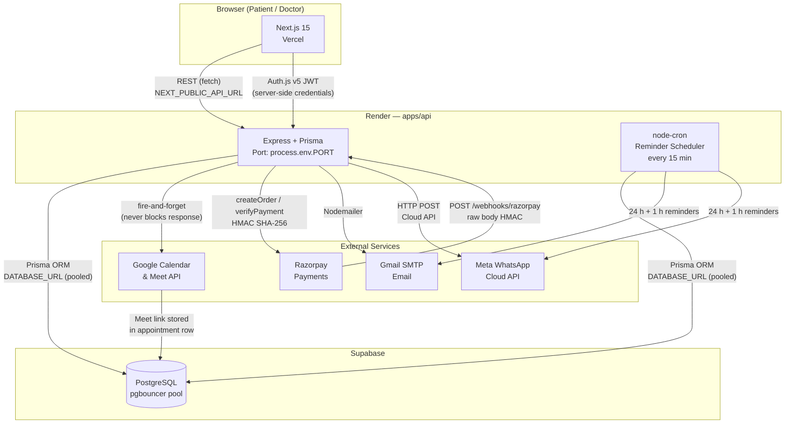

# Dr. Greeshma Connect — Smart Telehealth Booking Platform

A premium, mobile-first telehealth booking platform for Dr. Greeshma Gopinath, Obstetrician & Gynecologist.

[](https://github.com/LoneRanger-dev/dr-greeshma-connect/actions/workflows/ci.yml)


---

## Live URLs

| Service | URL |
|---|---|
| Frontend (Vercel) | _fill in after deploy_ |
| Backend API (Render) | _fill in after deploy_ |
| API Health | `<render-url>/health` |
| Admin Portal | `<vercel-url>/admin` |

> See [DEPLOYMENT.md](DEPLOYMENT.md) for the full deploy walkthrough.

---

## Architecture



### Monorepo layout

```
dr-greeshma-connect/
├─ apps/
│  ├─ web/                 # Next.js 15 (App Router) — patient UI + admin portal
│  └─ api/                 # Node/Express + Prisma — REST API
├─ packages/
│  └─ shared/              # Shared TypeScript types + Zod schemas
├─ .github/workflows/
│  └─ ci.yml               # GitHub Actions — lint, typecheck, test, e2e
├─ render.yaml             # Render IaC — build / pre-deploy / start
├─ DEPLOYMENT.md           # Full deploy + secret rotation guide
└─ README.md
```

### Stack

| Layer | Technology |
|---|---|
| Frontend | Next.js 15 (App Router, Turbopack), React 19, TypeScript |
| Styling | Tailwind CSS v4, ShadCN UI, Framer Motion v11 |
| 3D | React Three Fiber, @react-three/drei, @react-three/postprocessing |
| Forms | React Hook Form + Zod |
| Data fetching | TanStack Query (React Query) |
| Backend | Node.js 22, Express, TypeScript |
| ORM | Prisma 5 |
| Database | PostgreSQL via Supabase (pgbouncer pool) |
| Auth | Auth.js v5 (next-auth@beta) — JWT strategy, Credentials + Google |
| Payments | Razorpay (orders + webhook + HMAC verify) |
| Calendar | Google Calendar API + Google Meet |
| Notifications | Nodemailer (Email), Meta WhatsApp Cloud API |
| Testing | Vitest + RTL (unit), Playwright (e2e) |
| CI | GitHub Actions (lint → typecheck → test → e2e) |
| Deployment | Vercel (web), Render (api), Supabase (db) |

---

## Local Development

### Prerequisites

- Node.js ≥ 22
- pnpm 9 (`npm i -g pnpm@9`)
- A Supabase project (free tier works — get connection strings from project settings)

### 1. Clone & install

```bash
git clone <repo-url>
cd dr-greeshma-connect
pnpm install
```

### 2. Environment variables

```bash
# Backend
cp apps/api/.env.production.example apps/api/.env
# Edit apps/api/.env — fill in DATABASE_URL, DIRECT_URL, JWT secrets at minimum

# Frontend
cp apps/web/.env.production.example apps/web/.env.local
# Edit apps/web/.env.local — set NEXTAUTH_SECRET, NEXT_PUBLIC_API_URL=http://localhost:4000
```

### 3. Set up the database

```bash
# Push schema to Supabase (use db:push for local dev — avoids advisory lock issue)
pnpm --filter api db:generate
pnpm --filter api db:push

# Seed with doctor profile, services, and a demo patient
pnpm --filter api seed
```

### 4. Run both apps

```bash
# From repo root — starts web (port 3006) and api (port 4000) in parallel
pnpm dev
```

| App | URL |
|---|---|
| Frontend | http://localhost:3006 |
| API | http://localhost:4000 |
| Health check | http://localhost:4000/health |
| Prisma Studio | `pnpm --filter api db:studio` |

### 5. Seeded credentials

| Role | Email | Password |
|---|---|---|
| Doctor / Admin | `greeshma@clinic.com` | `Greeshma@123` |
| Demo Patient | `patient@demo.com` | `Patient@123` |

---

## Testing

```bash
# API — 34 Vitest unit tests (slots, payments, notifications)
pnpm --filter api test

# Web — 18 Vitest + RTL unit tests (booking wizard steps)
pnpm --filter web test

# Web — Playwright e2e happy path (requires API running on :4000)
pnpm --filter web test:e2e

# Coverage report
pnpm --filter web test:coverage
```

CI runs all three suites on every push to `main` — see [`.github/workflows/ci.yml`](.github/workflows/ci.yml).

---

## Key Design Decisions

- **pnpm workspaces monorepo** — `apps/web` and `apps/api` share types from `packages/shared`; build order enforced in CI and `render.yaml`
- **UTC storage, IST display** — all timestamps stored in UTC; converted to `Asia/Kolkata` in the UI via `toLocaleString("en-IN", { timeZone: "Asia/Kolkata" })`
- **Double-booking prevention** — DB-level `UNIQUE(doctorId, startsAt)` constraint inside a Prisma transaction; pre-flight 400 before the insert
- **Non-blocking integrations** — Google Calendar and notification calls are fire-and-forget; `.catch(logger.warn)` so a Google outage never breaks a booking confirmation
- **Two Prisma connection strings** — `DATABASE_URL` (pgbouncer pooled, used at runtime) + `DIRECT_URL` (non-pooled, used only by `prisma migrate deploy`) prevents P1002 advisory-lock timeout on Supabase
- **Razorpay webhook before `express.json()`** — raw body must be read before the JSON middleware consumes it; HMAC-SHA256 verified before any state change
- **`MotionConfig reducedMotion="user"`** — global Framer Motion catch-all for `prefers-reduced-motion`; Three.js bloom and CSS animations also disabled via media query
- **Mobile-first** — every page designed for 375 px first, enhanced for desktop

---

## Build Steps

This project was scaffolded in 16 ordered steps. See `BUILD_PROMPTS.md` for the full prompt sequence.

| Step | Feature |
|---|---|
| 0 | Monorepo scaffold |
| 1 | Next.js 15 init + deps |
| 2 | Design system (Tailwind v4 tokens, MagicButton, GlassCard) |
| 3 | Landing page (Hero with 3D aurora orb) |
| 4 | Doctor profile & service pages |
| 5 | Prisma schema + seed |
| 6 | Backend auth (JWT, RBAC, audit log) |
| 7 | Scheduling engine (slot generation, no double booking) |
| 8 | Booking wizard UI (5-step AnimatePresence flow) |
| 9 | Auth.js v5 integration (Credentials + Google) |
| 10 | Admin portal (dashboard, appointments, availability, patients) |
| 11 | Google Calendar + Meet (fire-and-forget, OAuth token stored in DB) |
| 12 | Razorpay payments (orders, HMAC verify, webhook) |
| 13 | Email + WhatsApp notifications + cron reminders |
| 14 | 3D & motion polish (Bloom, cursor glow, card tilt, gradient borders) |
| 15 | Testing & hardening (Vitest, Playwright, security audit, CI) |
| 16 | Deployment (Vercel + Render + Supabase) |
